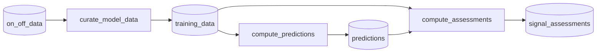

# Baseline performance

To evaluate the AI's performance, we need to know what the building _would have done_ without AI control. This counterfactual is called the **baseline**. The baseline system trains a model for each signal in a building that predicts the signal's value as a function of outdoor temperature, using historical data from periods when the AI was not in control.

## Architecture

The baseline system is a weekly Spark pipeline that reads from the `on_off_data` Iceberg table and produces three output tables in the `myrspoven-core.baselines` namespace. It runs as a single Airflow DAG with three sequential tasks.



The three tasks run sequentially as a single Airflow DAG: `curate_model_data` -\> `compute_predictions` -\> `compute_assessments`. A fourth table, `signal_assessment_overrides`, is managed separately via the dashboard and is never written by the pipeline.

All four tables are consumed downstream by the dashboard and other pipelines.

### Output tables

| Table | Description | Size |
| --- | --- | --- |
| `myrspoven-core.baselines.training_data` | The curated reference data the model was trained on. Provides traceability and is used for dashboard scatter plots and debugging. | Partitioned by `building_id` |
| `myrspoven-core.baselines.predictions` | Precomputed LOWESS predictions at a fixed temperature grid. This _is_ the baseline model -- consumers join against it instead of loading and running a model. | ~200 buildings x ~10 signals x 181 grid points |
| `myrspoven-core.baselines.signal_assessments` | Rule-based quality assessment per signal. Indicates whether the baseline for a given signal is trustworthy. | ~2000 rows total |
| `myrspoven-core.baselines.signal_assessment_overrides` | Human overrides of assessments, managed via the dashboard. Never written by the training pipeline. | Tiny |

### Refresh cadence

The training DAG runs **weekly** (Mondays 08:00 UTC). Each run does a full overwrite of `training_data`, `predictions`, and `signal_assessments`. Human overrides are never touched by the pipeline.

## Training data curation

The first task (`curate_model_data`) selects and filters reference data from the `on_off_data` table. The goal is to get a clean, representative dataset of what each signal does when the AI is _not_ in control.

### Filtering

1. **OFF-period only**: Rows where `hourly_on_off = 'off'`, meaning the AI was not controlling (`ds=0`) but the HVAC circuit was operational (`circuit_on=True`).
2. **Drop nulls**: Rows with null outdoor temperature (`t`) or signal `value` are removed.
3. **VSGT warm-weather exclusion**: For signals with a class containing `VSGT`, rows where `t > 20` are removed. Heating signals are not meaningful in warm weather.

### Temperature coverage selection

For each signal, the pipeline selects the most recent data window that covers at least **90%** of the signal's full observed outdoor temperature range. This ensures the model has seen enough of the operating envelope without using unnecessarily old data.

The algorithm works by scanning backwards from the newest data point:

1. Compute the overall `t_min` and `t_max` across all data for the signal.
2. Order rows by timestamp descending (newest first).
3. Expand a running window, tracking the running `t_min` and `t_max`.
4. Find the earliest timestamp where `(running_t_max - running_t_min) / (all_t_max - all_t_min) >= 0.9`.
5. Keep only rows at or after that cutoff.

If coverage never reaches 90%, or the temperature range is zero (constant signal), all data is kept.

## The LOWESS model

Each signal's baseline is modeled using [LOWESS](https://en.wikipedia.org/wiki/Local_regression) (Locally Weighted Scatterplot Smoothing) -- a non-parametric regression that fits the relationship between outdoor temperature and signal value.

### How it works

1. The curated reference data provides `(outdoor_temperature, signal_value)` pairs from OFF periods.
2. LOWESS fits a local weighted regression at each query point, using nearby data points. The `frac` parameter controls how much of the data is used for each local fit.
3. Instead of storing the raw data and re-computing LOWESS at query time, predictions are **precomputed** at a fixed temperature grid and stored in the `predictions` table. Consumers look up baseline values via a simple table join or interpolation.

### Parameters

| Parameter | Value | Rationale |
| --- | --- | --- |
| `frac` | 0.3 | Fraction of data used in each local regression. Produces smooth curves without overfitting. |
| Temperature grid | -40.0 to \+50.0 in 0.5 steps (181 points) | Covers Nordic winters through warm summers. At 0.5 resolution, linear interpolation error is negligible. |
| Minimum data points | 3 | Signals with fewer than 3 valid `(t, value)` pairs are skipped (no prediction produced). |

### Clipping rules

After computing LOWESS predictions, signal-class-specific clipping is applied to keep values within physically reasonable bounds:

| Signal classes | Clipping rule |
| --- | --- |
| `Vs_VSGT`, `VFs_VSGT`, `PVs_VSGT` | Clipped to \[20, 120\] (heating supply temperatures) |
| `Vs_ZACL`, `Vs_ZAHL`, `Vs_ZAGT`, `Vs_LBGP`, `Vs_KBGT`, `Vs_LBGT`, `VFs_LBGP`, `VFs_KBGT`, `VFs_LBGT`, `PVs_LBGP`, `PVs_LBGT`, `PVs_KBGT` | Clipped to the observed range in the training data `[ref_min, ref_max]` |
| All other classes (including `DHMs`, `DCMs`, `ELMs`, `Os_deg`, `Os_CO2`) | Clipped to `[0, inf)` (values can't be negative) |

### VSGT base temperature masking

For VSGT signals (heating circuits), predictions at outdoor temperatures **above** the building's base temperature are set to NULL. The base temperature is the outdoor temperature above which the building no longer needs heating -- predictions above it are meaningless. The base temperature is sourced from the Meter Data Pipeline.

## Signal coverage

Baselines are trained for every signal class present in the `on_off_data` table. No signal class filter is applied during curation -- if it's in the on-off dataset, it gets a baseline.

| Category | Signal classes |
| --- | --- |
| Variables (Vs) | `Vs_VSGT`, `Vs_LBGP`, `Vs_LBGT`, `Vs_KBGT`, `Vs_ZAGT`, `Vs_ZACL`, `Vs_ZAHL` |
| Variables Fixed (VFs) | `VFs_VSGT`, `VFs_LBGP`, `VFs_LBGT`, `VFs_KBGT` |
| Proportional Variables (PVs) | `PVs_VSGT`, `PVs_LBGP`, `PVs_LBGT`, `PVs_KBGT` |
| Observables (Os) | `Os_deg`, `Os_CO2` |
| Energy meters | `DHMs`, `DCMs`, `ELMs` |

## Signal assessments

Not every signal has enough reference data to produce a trustworthy baseline. The assessment pipeline evaluates each signal's data quality using rule-based checks and produces a pass/fail verdict stored in `signal_assessments`.

### How assessments work

The pipeline buckets each signal's training data into **3-degree temperature bins** and computes per-bucket statistics (`v_min`, `v_max`, `v_range`, `v_mean`, `v_median`). These are then aggregated into signal-level metrics and checked against a set of rules.

The assessment is either `"OK"` or a string describing the first failing rule (e.g. `"Baseline training data covers enough temperature range"`).

### Assessment rules by signal class

**General rules** (applied to all signal classes):

1. **Has valid stats** -- fails if there are fewer than 5 valid data points or no bucket statistics could be computed.
2. **Covers enough temperature range** -- fails if the overall temperature range `(t_max - t_min)` is less than 8 degrees.

**Additional rules per signal class:**

| Signal class | Additional rules |
| --- | --- |
| VSGT (any class containing `VSGT`) | Heating temperature range \>= 10 (buckets where `t_max <= 12`). No more than 1 noisy cold-weather bucket (where `t_max <= -3` and `v_range > 15`). Negative OLS slope (cold weather should produce higher supply temps). Value range \>= 5. |
| `DHMs`, `DCMs`, `ELMs` | Value range \>= 10. |
| LBGT, KBGT | Value range \>= 0.5. |
| ZACL, ZAHL | Value range \>= 0.9. |
| LBGP, ZAGT, and all others | General rules only. |

### Model fit metric

In addition to rule-based checks, the pipeline computes **MAE** (Mean Absolute Error) between the LOWESS predictions and the training data for each signal. This is stored in `signal_assessments.fit_mae` for monitoring but does not currently affect the pass/fail verdict.

### Human overrides

Assessments can be overridden by humans via the dashboard. Overrides are stored in a separate table (`signal_assessment_overrides`) that is never touched by the training pipeline. Consumers merge the two tables at read time:

```sql
COALESCE(override.assessment, model.assessment) AS effective_assessment
```

This means:

- If a human override exists, it takes precedence.
- If no override exists, the model-computed assessment is used.
- Model metrics (`fit_mae`) are always preserved regardless of overrides.